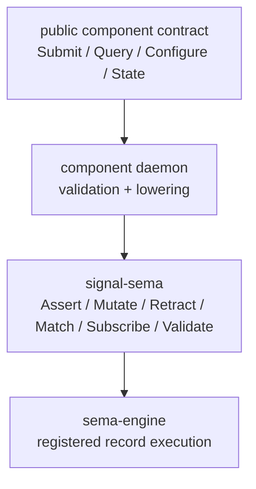

# signal-sema Architecture

`signal-sema` owns the Sema execution vocabulary: the typed operations a
database engine performs against registered record families, the
read-algebra pattern primitives those operations carry, and the typed
identity values they address state with.

It is below public component contracts. A component contract may expose
domain-local operations such as `Submit`, `Query`, `Observe`, or
`Configure`; the daemon lowers those public operations into Sema
operations when it reads or changes durable state.

The migration that introduced this crate is described in the primary
workspace:

- `reports/designer/238-signal-architecture-redirection-contract-local-verbs.md`
- `reports/designer/239-signal-architecture-migration-plan.md`

## Constraints

- `signal-sema` is a Rust library crate.
- `signal-sema` contains no daemon, actor, socket, redb, or runtime code.
- `signal-sema` contains no Persona-specific, Criome-specific, or
  component-specific payload records.
- `signal-sema` does not depend on `signal-frame`; the frame layer and
  the Sema execution vocabulary are separate. (Other contract crates may
  depend on both.)
- `SemaOperation` is the closed Sema operation set.
- `SemaOperation` is rkyv-archivable and NOTA-encodable.
- `SemaOperation` record-head spelling is PascalCase and stable.
- Atomicity is structural in the engine request/commit shape, not a Sema
  operation.
- Type names inside the crate do not restate the `Sema` or `Signal`
  namespace; the domain is implicit. (Per
  `~/primary/skills/naming.md`.)

## Operation Set

| Operation | Meaning |
|---|---|
| `Assert` | Insert or append a typed record. |
| `Mutate` | Replace or transition an existing typed record. |
| `Retract` | Tombstone, remove, or retract a typed record. |
| `Match` | Read records by key, range, pattern, or plan. |
| `Subscribe` | Open state-plus-delta observation over records. |
| `Validate` | Dry-run validation/planning without committing. |

Operation classification is exposed as `OperationClass`:
`Write` (Assert / Mutate / Retract), `Read` (Match), `Stream`
(Subscribe), `Validation` (Validate). Daemons that need to dispatch on
the broad class of effect use this; daemons that need a fine-grained
decision dispatch on the operation itself.

## Pattern Primitives

`Match` and `Subscribe` carry typed payloads that may include unbound
or capture positions. The pattern primitives that mark these positions
live in this crate because they are inseparable from the read-algebra
operations.

| Type | Encoding | Use |
|---|---|---|
| `Bind` | `(Bind)` | At this position, capture the matched value into the pattern's bind set. |
| `Wildcard` | `(Wildcard)` | At this position, accept any value and do not bind it. |
| `PatternField<T>::Bind` | `(Bind)` | Bind, embedded in a typed `T` position. |
| `PatternField<T>::Wildcard` | `(Wildcard)` | Wildcard, embedded in a typed `T` position. |
| `PatternField<T>::Match(value)` | encoding of `value` | A concrete value to match against; transparent over `T`. |

`PatternField<T>` is **transparent** over its `Match` arm — the inner
value's encoding is used directly, without a `Match` wrapper — so that
the same wire shape works for plain values and for pattern positions.
`Bind` and `Wildcard` are typed records, not sigils; `@name` and `_`
are not patterns.

## Identity Primitives

Sema operations that target an existing typed record (`Mutate`,
`Retract`) name it by `Slot<Payload>` and `Revision`. `Match` and
`Subscribe` reply rows cite the same pair when reporting what was
read. These are wire-identity values only.

| Type | Shape | Use |
|---|---|---|
| `Slot<Payload>` | phantom-typed `u64` newtype | Stable identity for a typed record family. |
| `Revision` | `u64` generation | Monotonic generation counter at a slot. |

Allocation, lookup, compare-and-set, and persistence belong to the
Sema engine; this crate only owns the typed wire shape and the family
marker.

## Boundary



## Non-Goals

- No public component operation vocabulary.
- No request/reply frame mechanics. (Frame envelope, handshake,
  exchange identifiers, async correlation, streams, and reply
  plumbing live in `signal-frame`.)
- No authorization or routing.
- No NOTA surface policy beyond typed record codec.
- No `ReadPlan` operators (`Constrain`, `Project`, `Aggregate`,
  `Infer`, `Recurse`). Those belong in `sema-engine` and/or in
  component contracts that publish their read plans.
- No `Operation<Payload>` / `Request<Payload>` envelope. Those live
  in `signal-frame`.

## Code Map

```text
src/lib.rs       module entry and re-exports
src/operation.rs SemaOperation + OperationClass; NotaEnum derives
src/pattern.rs   Bind, Wildcard, PatternField<T>; hand-written codec
src/identity.rs  Slot<Payload>, Revision; rkyv identity records
tests/operation.rs   SemaOperation round trips (NOTA + rkyv) and
                     class/is-write witnesses
tests/pattern.rs     Bind / Wildcard / PatternField<T> round trips
                     (NOTA + rkyv) and pattern dispatch witnesses
tests/identity.rs    Slot<T> / Revision rkyv round trips
examples/canonical.nota  Canonical record-head spelling per operation
```
