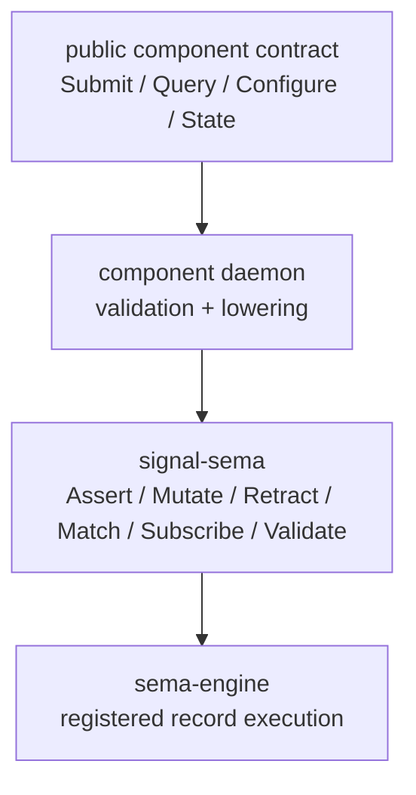

# signal-sema Architecture

`signal-sema` owns the Sema execution vocabulary: the typed operations a
database engine performs against registered record families.

It is below public component contracts. A component contract may expose
domain-local operations such as `Submit`, `Query`, `Observe`, or
`Configure`; the daemon lowers those public operations into Sema operations
when it reads or changes durable state.

## Constraints

- `signal-sema` is a Rust library crate.
- `signal-sema` contains no daemon, actor, socket, redb, or runtime code.
- `signal-sema` contains no Persona-specific, Criome-specific, or
  component-specific payload records.
- `signal-sema` does not depend on `signal-core`; the frame layer and the
  Sema execution vocabulary are separate.
- `SemaOperation` is the closed Sema operation set.
- `SemaOperation` is rkyv-archivable and NOTA-encodable.
- `SemaOperation` record-head spelling is PascalCase and stable.
- Atomicity is structural in the engine request/commit shape, not a Sema
  operation.

## Operation Set

| Operation | Meaning |
|---|---|
| `Assert` | Insert or append a typed record. |
| `Mutate` | Replace or transition an existing typed record. |
| `Retract` | Tombstone, remove, or retract a typed record. |
| `Match` | Read records by key, range, pattern, or plan. |
| `Subscribe` | Open state-plus-delta observation over records. |
| `Validate` | Dry-run validation/planning without committing. |

## Boundary

## Non-Goals

- No public component operation vocabulary.
- No request/reply frame mechanics.
- No authorization or routing.
- No NOTA surface policy beyond typed record codec.
