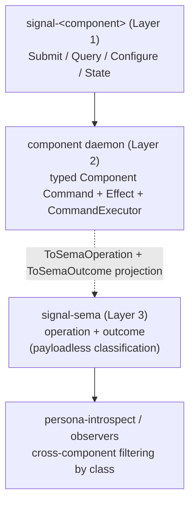

# signal-sema Architecture

`signal-sema` owns the universal Sema classification vocabulary: the
*payloadless* state-action class labels used for cross-component
observation and introspection, plus the read-algebra pattern
primitives, qualitative magnitude vocabulary, and typed identity
values components carry inside their own typed records.

The classification vocabulary is the third layer of the three-layer
model affirmed 2026-05-20 (per
`reports/designer/246-v4-bundled-fix-deep-design-with-examples.md`
and `intent/component-shape.nota` 2026-05-20T02:00Z):

| Layer | Owns | Examples |
|---|---|---|
| Contract Operation (external, on the wire) | the domain action the caller invokes | `Submit(Message)`, `Query(Selection)`, `State(Statement)` |
| Component Command (internal, per-daemon) | the daemon's typed executable record | `LedgerCommand::RecordEvent(EventRecord)`, `SpiritCommand::AssertEntry(Entry)` |
| Sema Operation (cross-component classification) | the universal payloadless class label | `Assert`, `Mutate`, `Retract`, `Match`, `Subscribe`, `Validate` |

`signal-sema` is the home of Layer 3. Component contracts (Layer 1)
define their own domain verbs in their `signal-<component>` crates;
daemons (Layer 2) define their typed Command and Effect enums
internally and project to Sema classes via `ToSemaOperation` and
`ToSemaOutcome` traits so observers can filter on classification
without knowing per-daemon command payloads.

The earlier migration that introduced this crate is described in the
primary workspace:

- `reports/designer/238-signal-architecture-redirection-contract-local-verbs.md`
- `reports/designer/239-signal-architecture-migration-plan.md`
- `reports/designer/246-v4-bundled-fix-deep-design-with-examples.md`
  (three-layer affirmation; supersedes the earlier "Sema as
  execution vocabulary" framing).
- `reports/designer/248-three-layer-changes-for-operators.md`
  (per-crate impact summary).

## Constraints

- `signal-sema` is a Rust library crate.
- `signal-sema` contains no daemon, actor, socket, redb, or runtime code.
- `signal-sema` contains no Persona-specific, Criome-specific, or
  component-specific payload records.
- `signal-sema` does not depend on `signal-frame`; the frame layer and
  the Sema classification vocabulary are separate. (Other contract
  crates may depend on both.)
- `SemaOperation` is the closed command classification set —
  payloadless variants only; never carries executable payloads.
- `SemaOutcome` is the closed effect classification set —
  payloadless variants only; never carries component event payloads.
- `SemaObservation` joins one `SemaOperation` with one `SemaOutcome`;
  it does not carry timing, sequence, or component payload data.
- `SemaOperation` is rkyv-archivable and NOTA-encodable.
- `SemaOutcome` and `SemaObservation` are rkyv-archivable and
  NOTA-encodable.
- `Magnitude` currently encodes the seven ordered qualitative
  strength rungs from `Minimum` through `Maximum`; the next schema
  widens it with `Unknown` for indeterminate health and readiness
  readings.
- `SemaOperation` record-head spelling is PascalCase and stable.
- Atomicity is structural in the engine request/commit shape and is
  expressed via typed component commands (Layer 2), not via Sema
  variants.
- Type names inside the crate do not restate the `Sema` or `Signal`
  namespace; the domain is implicit. (Per
  `~/primary/skills/naming.md`.)

## Operation Classification Set

| Class | Meaning (as observation label) |
|---|---|
| `Assert` | The component appended a new typed fact / event / row. |
| `Mutate` | The component transitioned a record at stable identity. |
| `Retract` | The component tombstoned / removed a typed record. |
| `Match` | The component performed a pattern / range / key read. |
| `Subscribe` | The component opened a state-plus-delta stream. |
| `Validate` | The component dry-ran an operation without commit. |

These are *labels* — the daemon emits one per executed Component
Command so observers can filter cross-component activity by class.
The actual executable payload is the Component Command, not the
class.

Operation classification is exposed as `OperationClass`:
`Write` (Assert / Mutate / Retract), `Read` (Match), `Stream`
(Subscribe), `Validation` (Validate). Observers that need to dispatch
on the broad class of effect use this; observers that need a
fine-grained decision dispatch on the class itself.

## Outcome Classification Set

| Outcome | Meaning (as observation label) |
|---|---|
| `Asserted` | A new typed fact / event / row was appended. |
| `Mutated` | An existing typed record transitioned at stable identity. |
| `Retracted` | A typed record was tombstoned / removed. |
| `Matched` | Typed records were read. |
| `Subscribed` | A state-plus-delta stream was opened. |
| `Validated` | A dry-run validation or planning request completed. |
| `NoChange` | The request completed without changing observable state. |

`SemaObservation` composes both halves:

```rust
SemaObservation {
    operation: command.to_sema_operation(),
    outcome: effect.to_sema_outcome(),
}
```

## Qualitative Magnitude

`Magnitude` names a workspace-universal qualitative strength scale,
used by component records that need to express a coarse reading of
certainty, priority, severity, intensity, health, readiness, or any
other non-numeric strength.

The current deployed schema is the seven ordered rungs below:

| Variant | Rank |
|---|---|
| `Minimum` | Lowest strength on the scale. |
| `VeryLow` | Below `Low`. |
| `Low` | Lower-middle strength. |
| `Medium` | Centre of the scale. |
| `High` | Upper-middle strength. |
| `VeryHigh` | Above `High`. |
| `Maximum` | Highest strength on the scale. |

The current set is **closed** and **ordered** (`PartialOrd` and
`Ord` derives preserve declared rank). Components match a subset
(`magnitude == Maximum`), use range comparison (`magnitude >= High`),
or read the full variant set.

The next schema widens `Magnitude` with `Unknown`. `Unknown` is for
indeterminate readings, especially health and readiness states where
the component can report that a state exists but cannot rank it on
the strength scale. `Unknown` is not a reserved future rung and not a
weaker or stronger value; it is categorically outside the ordering.
Until that widening lands, records carrying `Unknown` continue to
fail decode under the current seven-rung schema.

**The vocabulary is the schema; consumption is per-component policy.**
A component that classifies finely emits any of the seven; a component
that matches only coarse distinctions reads the full set and matches
against a subset. Never collapse the wire vocabulary to fit a current
consumption policy — that move forces writers to flatten distinctions
they perceive and replays the drift the universal vocabulary exists
to prevent.

**Field name carries the dimension; type carries the scale.** Records
hold `certainty: Magnitude` (Spirit's `Entry`), `priority: Magnitude`
(Mind item priority), `severity: Magnitude` (any future component).
The field name supplies the dimension; the type supplies the strength
scale. No wrapping type like `SizeMagnitude` (would duplicate "scale"
in the type name) or `IntentCertainty` (would tie the universal scale
to one domain). Per
`~/primary/skills/naming.md` and the branches/leaves vocabulary in
`~/primary/skills/language-design.md` — `Magnitude` is a fixed-size
leaf, the canonical worked example of the leaf shape.

## Pattern Primitives

Component Commands whose class projects to `Match` or `Subscribe`
typically carry typed payloads that may include unbound or capture
positions. The pattern primitives that mark these positions live in
this crate because they are inseparable from the read-algebra shape;
component daemons reuse them inside their own typed Commands.

| Type | Encoding | Use |
|---|---|---|
| `Bind` | `(Bind)` | At this position, capture the matched value into the pattern's bind set. |
| `Wildcard` | `(Wildcard)` | At this position, accept any value and do not bind it. |
| `PatternField<T>::Bind` | `(Bind)` | Bind, embedded in a typed `T` position. |
| `PatternField<T>::Wildcard` | `(Wildcard)` | Wildcard, embedded in a typed `T` position. |
| `PatternField<T>::Match(value)` | encoding of `value` | A concrete value to match against; transparent over `T`. |

`PatternField<T>` is **transparent** over its `Match` arm — the inner
value's encoding is used directly, without a `Match` wrapper — so that
the same wire shape works for plain values and for pattern positions.
`Bind` and `Wildcard` are typed records, not sigils; `@name` and `_`
are not patterns.

## Identity Primitives

Component Commands that target an existing typed record (when their
class projects to `Mutate` or `Retract`) name it by `Slot<Payload>`
and `Revision`. Read-shaped commands (`Match` / `Subscribe`) cite the
same pair when reporting what was read. These are wire-identity
values only.

| Type | Shape | Use |
|---|---|---|
| `Slot<Payload>` | phantom-typed `u64` newtype | Stable identity for a typed record family. |
| `Revision` | `u64` generation | Monotonic generation counter at a slot. |

Allocation, lookup, compare-and-set, and persistence belong to each
daemon's `CommandExecutor` (over `sema-engine`); this crate only owns
the typed wire shape and the family marker.

## Boundary



## Non-Goals

- No public component operation vocabulary (Layer 1 lives in
  `signal-<component>` crates).
- No per-daemon executable Command vocabulary (Layer 2 lives in each
  daemon crate).
- No executable payloads inside `SemaOperation` variants; the
  classification is payloadless.
- No request/reply frame mechanics. (Frame envelope, handshake,
  exchange identifiers, async correlation, streams, and reply
  plumbing live in `signal-frame`.)
- No authorization or routing.
- No NOTA surface policy beyond typed record codec.
- No `ReadPlan` operators (`Constrain`, `Project`, `Aggregate`,
  `Infer`, `Recurse`). Those belong in `sema-engine` and/or in
  component contracts that publish their read plans.
- No `Request<Payload>` envelope. That lives in `signal-frame`.

## Possible features (not decided)

*Items here are under consideration, not committed. Each names the
open question; moves to the cemented body when settled, retires when
ruled out. Per `~/primary/skills/architecture-editor.md` §"Carrying
uncertainty".*

- **`Unknown` comparison surface.** Adding `Unknown` is decided; the
  remaining question is how comparison APIs behave once it exists.
  One shape makes `Magnitude` partially ordered, with comparisons
  involving `Unknown` returning no order. Another keeps an
  `OrderedMagnitude` projection over only the seven ordered rungs and
  treats `Magnitude` as the wider categorical vocabulary.

## Code Map

```text
src/lib.rs       module entry and re-exports
src/operation.rs SemaOperation + OperationClass; NotaEnum derives
src/outcome.rs   SemaOutcome + SemaObservation; NotaEnum/NotaRecord derives
src/magnitude.rs Magnitude; current ordered seven-level NotaEnum
src/pattern.rs   Bind, Wildcard, PatternField<T>; hand-written codec
src/identity.rs  Slot<Payload>, Revision; rkyv identity records
tests/operation.rs   SemaOperation round trips (NOTA + rkyv) and
                     class/is-write witnesses
tests/outcome.rs     SemaOutcome + SemaObservation projection and
                     round trips (NOTA + rkyv)
tests/magnitude.rs   Magnitude round trips (NOTA + rkyv), current
                     ordering, unknown-head rejection, and canonical
                     coverage
tests/pattern.rs     Bind / Wildcard / PatternField<T> round trips
                     (NOTA + rkyv) and pattern dispatch witnesses
tests/identity.rs    Slot<T> / Revision rkyv round trips
examples/canonical.nota  Canonical record-head spelling per operation/outcome
```
