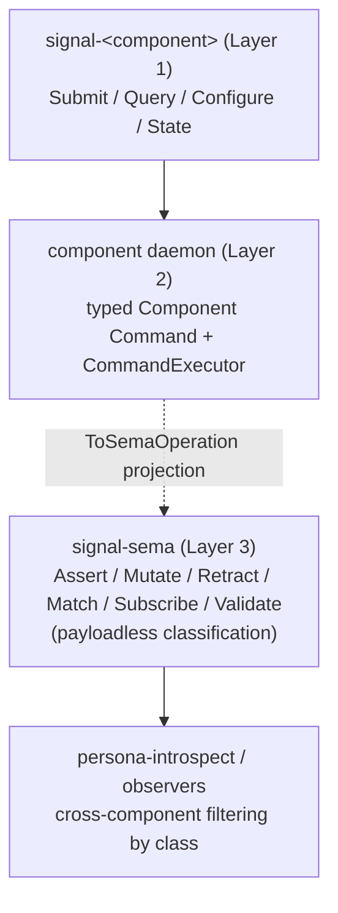

# signal-sema Architecture

`signal-sema` owns the universal Sema classification vocabulary: the
*payloadless* state-action class labels used for cross-component
observation and introspection, plus the read-algebra pattern
primitives and typed identity values components carry inside their
own typed records.

The classification vocabulary is the third layer of the three-layer
model affirmed 2026-05-20 (per
`reports/designer/246-v4-bundled-fix-deep-design-with-examples.md`
and `intent/component-shape.nota` 2026-05-20T02:00Z):

| Layer | Owns | Examples |
|---|---|---|
| Contract Operation (external, on the wire) | the domain action the caller invokes | `Submit(Message)`, `Query(Selection)`, `State(Statement)` |
| Component Command (internal, per-daemon) | the daemon's typed executable record | `LedgerCommand::RecordEvent(EventRecord)`, `SpiritCommand::AssertEntry(Entry)` |
| Sema Operation (cross-component classification) | the universal payloadless class label | `Assert`, `Mutate`, `Retract`, `Match`, `Subscribe`, `Validate` |

`signal-sema` is the home of Layer 3. Component contracts (Layer 1)
define their own domain verbs in their `signal-<component>` crates;
daemons (Layer 2) define their typed Command enums internally and
project to Sema classes via a `ToSemaOperation` trait so observers
can filter on classification without knowing per-daemon command
payloads.

The earlier migration that introduced this crate is described in the
primary workspace:

- `reports/designer/238-signal-architecture-redirection-contract-local-verbs.md`
- `reports/designer/239-signal-architecture-migration-plan.md`
- `reports/designer/246-v4-bundled-fix-deep-design-with-examples.md`
  (three-layer affirmation; supersedes the earlier "Sema as
  execution vocabulary" framing).
- `reports/designer/248-three-layer-changes-for-operators.md`
  (per-crate impact summary).

## Constraints

- `signal-sema` is a Rust library crate.
- `signal-sema` contains no daemon, actor, socket, redb, or runtime code.
- `signal-sema` contains no Persona-specific, Criome-specific, or
  component-specific payload records.
- `signal-sema` does not depend on `signal-frame`; the frame layer and
  the Sema classification vocabulary are separate. (Other contract
  crates may depend on both.)
- `SemaOperation` is the closed classification set — payloadless
  variants only; never carries executable payloads.
- `SemaOperation` is rkyv-archivable and NOTA-encodable.
- `SemaOperation` record-head spelling is PascalCase and stable.
- Atomicity is structural in the engine request/commit shape and is
  expressed via typed component commands (Layer 2), not via Sema
  variants.
- Type names inside the crate do not restate the `Sema` or `Signal`
  namespace; the domain is implicit. (Per
  `~/primary/skills/naming.md`.)

## Classification Set

| Class | Meaning (as observation label) |
|---|---|
| `Assert` | The component appended a new typed fact / event / row. |
| `Mutate` | The component transitioned a record at stable identity. |
| `Retract` | The component tombstoned / removed a typed record. |
| `Match` | The component performed a pattern / range / key read. |
| `Subscribe` | The component opened a state-plus-delta stream. |
| `Validate` | The component dry-ran an operation without commit. |

These are *labels* — the daemon emits one per executed Component
Command so observers can filter cross-component activity by class.
The actual executable payload is the Component Command, not the
class.

Operation classification is exposed as `OperationClass`:
`Write` (Assert / Mutate / Retract), `Read` (Match), `Stream`
(Subscribe), `Validation` (Validate). Observers that need to dispatch
on the broad class of effect use this; observers that need a
fine-grained decision dispatch on the class itself.

## Pattern Primitives

Component Commands whose class projects to `Match` or `Subscribe`
typically carry typed payloads that may include unbound or capture
positions. The pattern primitives that mark these positions live in
this crate because they are inseparable from the read-algebra shape;
component daemons reuse them inside their own typed Commands.

| Type | Encoding | Use |
|---|---|---|
| `Bind` | `(Bind)` | At this position, capture the matched value into the pattern's bind set. |
| `Wildcard` | `(Wildcard)` | At this position, accept any value and do not bind it. |
| `PatternField<T>::Bind` | `(Bind)` | Bind, embedded in a typed `T` position. |
| `PatternField<T>::Wildcard` | `(Wildcard)` | Wildcard, embedded in a typed `T` position. |
| `PatternField<T>::Match(value)` | encoding of `value` | A concrete value to match against; transparent over `T`. |

`PatternField<T>` is **transparent** over its `Match` arm — the inner
value's encoding is used directly, without a `Match` wrapper — so that
the same wire shape works for plain values and for pattern positions.
`Bind` and `Wildcard` are typed records, not sigils; `@name` and `_`
are not patterns.

## Identity Primitives

Component Commands that target an existing typed record (when their
class projects to `Mutate` or `Retract`) name it by `Slot<Payload>`
and `Revision`. Read-shaped commands (`Match` / `Subscribe`) cite the
same pair when reporting what was read. These are wire-identity
values only.

| Type | Shape | Use |
|---|---|---|
| `Slot<Payload>` | phantom-typed `u64` newtype | Stable identity for a typed record family. |
| `Revision` | `u64` generation | Monotonic generation counter at a slot. |

Allocation, lookup, compare-and-set, and persistence belong to each
daemon's `CommandExecutor` (over `sema-engine`); this crate only owns
the typed wire shape and the family marker.

## Boundary



## Non-Goals

- No public component operation vocabulary (Layer 1 lives in
  `signal-<component>` crates).
- No per-daemon executable Command vocabulary (Layer 2 lives in each
  daemon crate).
- No executable payloads inside `SemaOperation` variants; the
  classification is payloadless.
- No request/reply frame mechanics. (Frame envelope, handshake,
  exchange identifiers, async correlation, streams, and reply
  plumbing live in `signal-frame`.)
- No authorization or routing.
- No NOTA surface policy beyond typed record codec.
- No `ReadPlan` operators (`Constrain`, `Project`, `Aggregate`,
  `Infer`, `Recurse`). Those belong in `sema-engine` and/or in
  component contracts that publish their read plans.
- No `Request<Payload>` envelope. That lives in `signal-frame`.

## Code Map

```text
src/lib.rs       module entry and re-exports
src/operation.rs SemaOperation + OperationClass; NotaEnum derives
src/pattern.rs   Bind, Wildcard, PatternField<T>; hand-written codec
src/identity.rs  Slot<Payload>, Revision; rkyv identity records
tests/operation.rs   SemaOperation round trips (NOTA + rkyv) and
                     class/is-write witnesses
tests/pattern.rs     Bind / Wildcard / PatternField<T> round trips
                     (NOTA + rkyv) and pattern dispatch witnesses
tests/identity.rs    Slot<T> / Revision rkyv round trips
examples/canonical.nota  Canonical record-head spelling per operation
```
